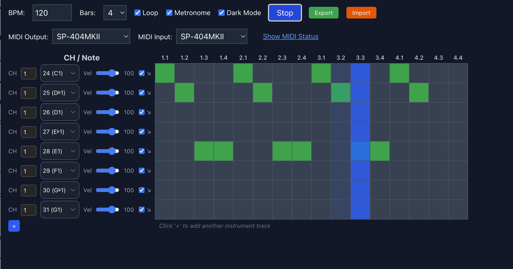

# react-midi-sequencer

A modular React step sequencer for browser-based MIDI loopers, beatmakers, and synth control interfaces.

## Features

- Step-based sequencer grid with per-step toggles
- MIDI output to external synths, VSTs, or DAWs via the Web MIDI API
- Adjustable BPM and number of bars (1, 2, 4, 8, 16)
- Per-track instrument configuration: channel, note (with name), velocity, note-off toggle
- Loop toggle, metronome click, play/pause controls
- MIDI output device selector with real-time status
- Collapsible MIDI status panel

## Screenshot



---

## Installation

```bash
npm install react-midi-sequencer


⸻

Usage

import { StepSequencer } from 'react-midi-sequencer'

function App() {
  return <StepSequencer />
}

Components
	•	StepGrid – Interactive sequencer grid
	•	InstrumentEditor – Per-track instrument/channel/note control
	•	useStepSequencer() – Hook for sequencer timing and state
	•	useMidiOutput() – Hook for managing Web MIDI output

Development

git clone https://github.com/elysiantech/react-midi-sequencer
cd react-midi-sequencer
npm install
npm run dev

License

MIT © Wiener M Mondesir

